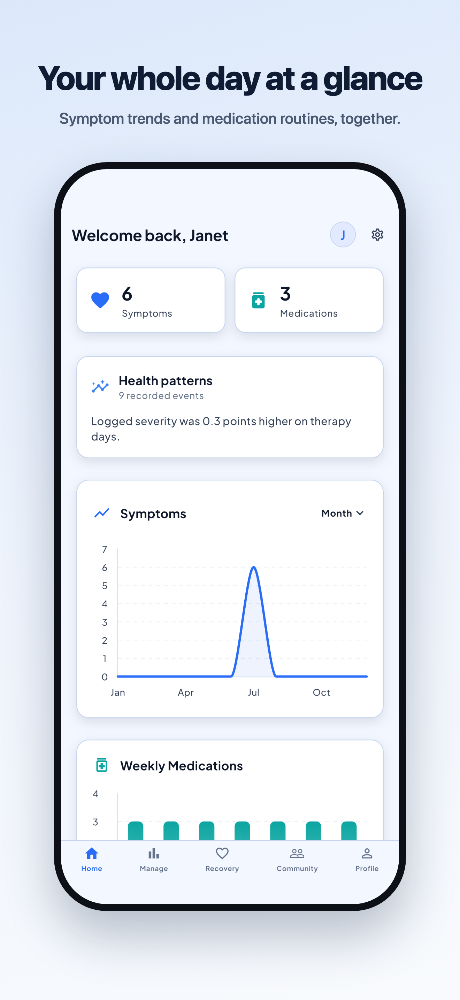
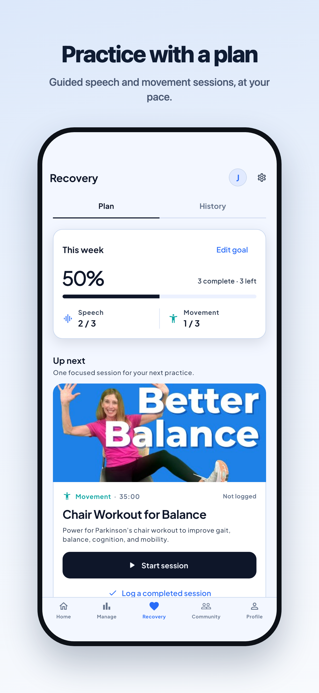
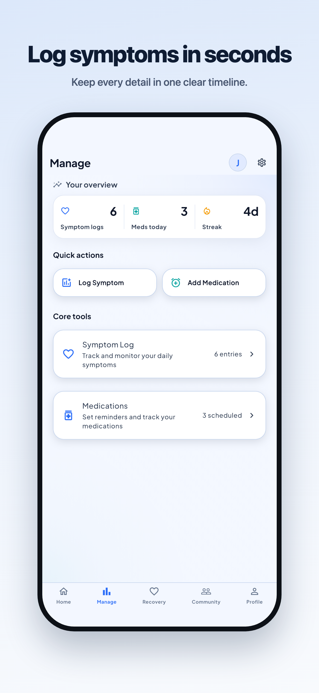
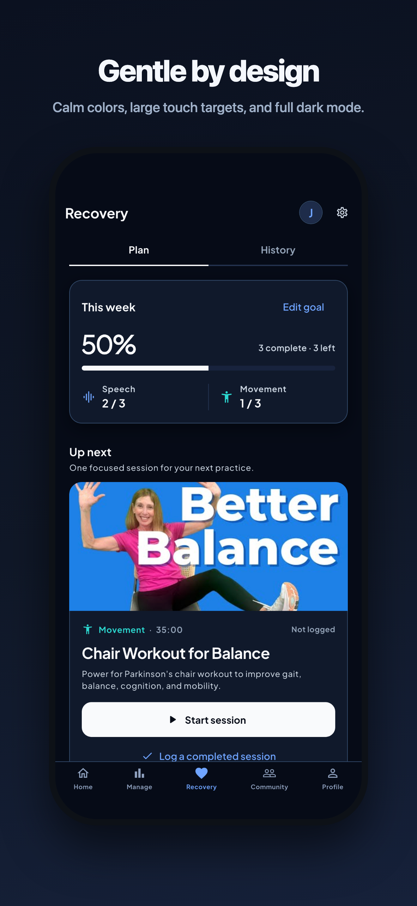

# ParkiWell

**A calmer way to manage Parkinson's care.**

Track symptoms, keep medication routines, and practice guided speech and
movement, all in one supportive place that works even when you're offline.

[**parkiwell.com**](https://parkiwell.com) · Coming soon to the App Store and Google Play

---

  
  
  
  

## Why ParkiWell

Living with Parkinson's means keeping track of a lot: how symptoms change
through the day, which dose was taken when, whether this week's speech and
movement practice happened. ParkiWell keeps all of it in one clear, calm
place, designed for real hands and real days.

### See your day clearly

Log a symptom in seconds with severity from *Very Mild* to *Very Severe*,
keep medication schedules with dose details in one timeline, and build a
logging streak that shows your consistency.

### Practice with a plan

Set an approachable weekly goal for speech and movement sessions, follow
guided videos from trusted Parkinson's programs, and keep a history of
everything you complete. You can even record a short practice clip to check
your form, and it never leaves your device.

### Notice patterns over time

Simple charts and on-device insights connect the dots across weeks and
months, like how logged severity compares on therapy days, without
sending your data anywhere for analysis.

### You're not doing this alone

An optional community space for posts, comments, and encouragement from
people who understand.

## Built for trust

- **Works offline.** Your records live on your device first and stay
  available with no connection; changes sync safely when you're back online.
- **Private by design.** No ads, no tracking, no analytics SDKs, no selling
  data. Cloud sync is optional and protected by row-level security.
- **Gentle by design.** Calm colors, large touch targets, reduced-motion
  support, VoiceOver/TalkBack labels, and full dark mode.
- **Delete anytime.** Remove your account and synced records from inside
  the app.

Read the full [Privacy Policy](https://parkiwell.com/privacy) and
[Terms of Service](https://parkiwell.com/terms), or visit
[Support](https://parkiwell.com/support).

## Medical disclaimer

ParkiWell is an organizational and educational tool. It is **not** a medical
device and does not provide medical advice, diagnosis, or treatment. Always
consult your care team about your health.

## For developers

ParkiWell is a Flutter app backed by Supabase (auth + PostgreSQL with
row-level security) with an offline-first sync engine. If you'd like to run
it locally or contribute, start with the
[contribution guide](CONTRIBUTING.md), which covers environment setup, the
backend, quality checks, and CI. Therapy video sources and attributions are
listed in [docs/CONTENT_SOURCES.md](docs/CONTENT_SOURCES.md).
